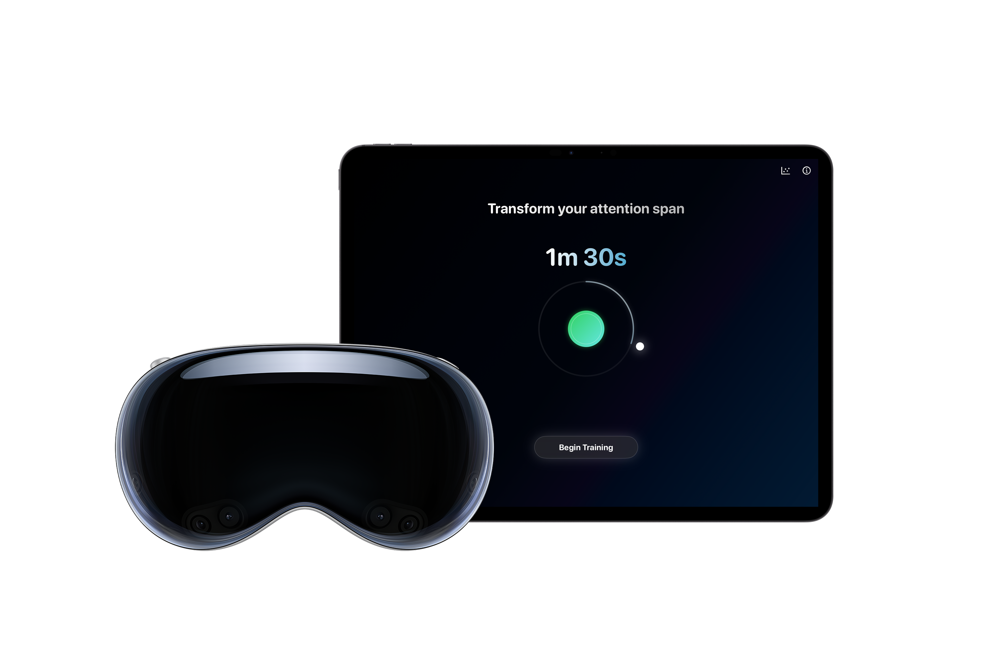
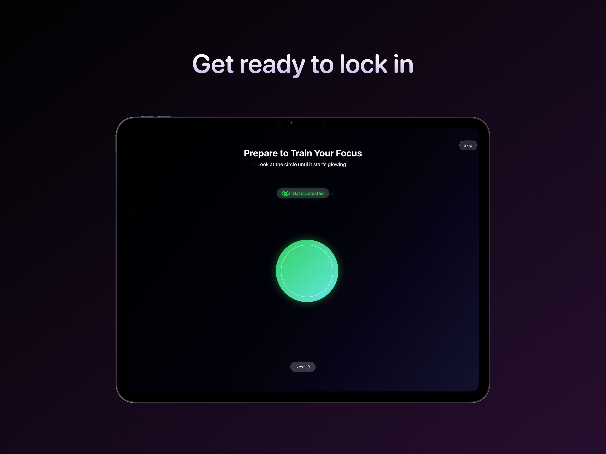
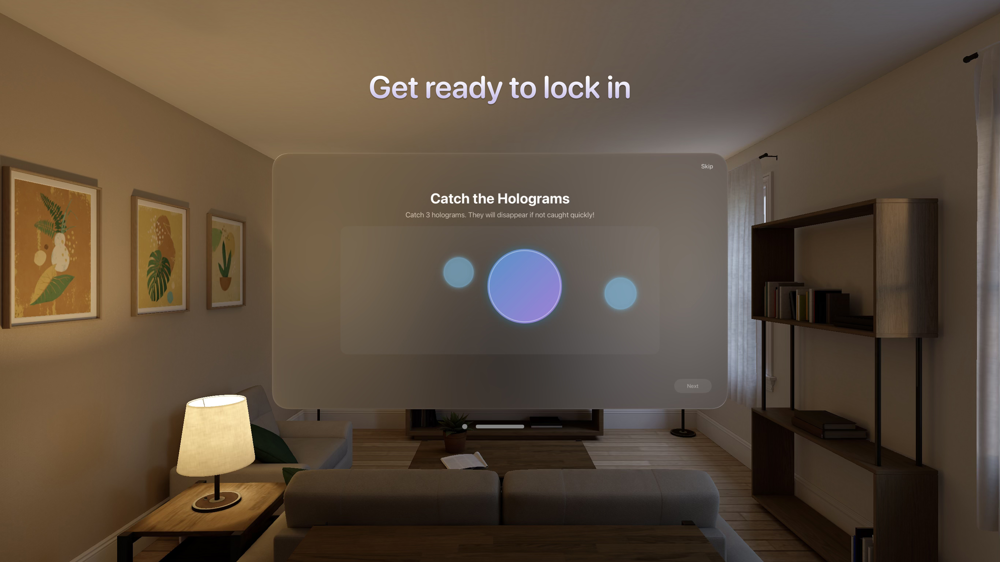
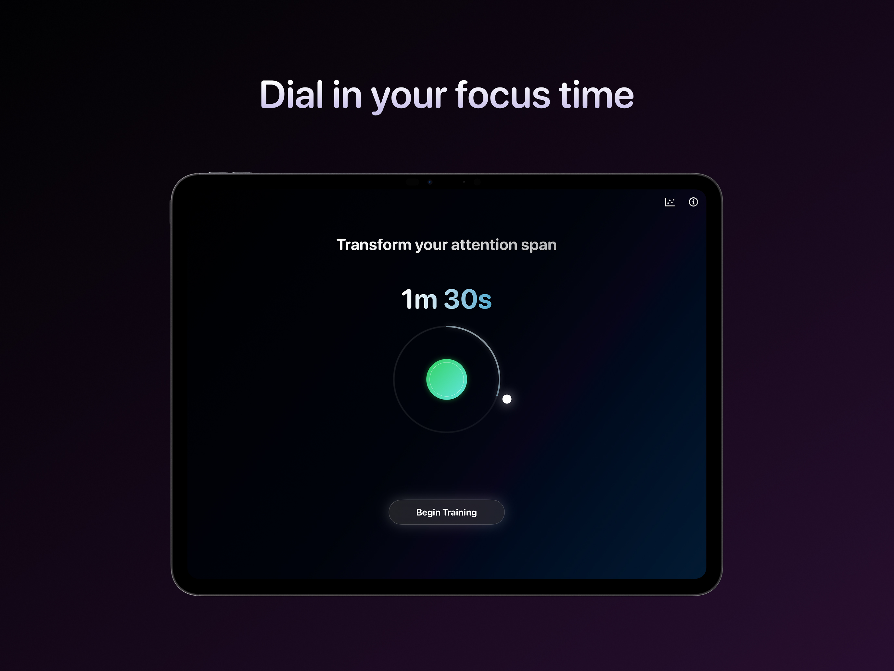
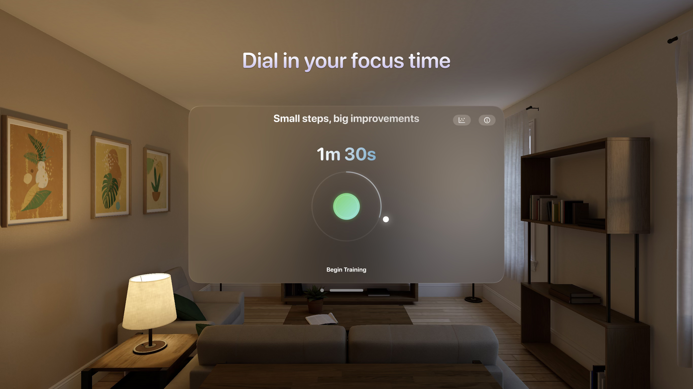
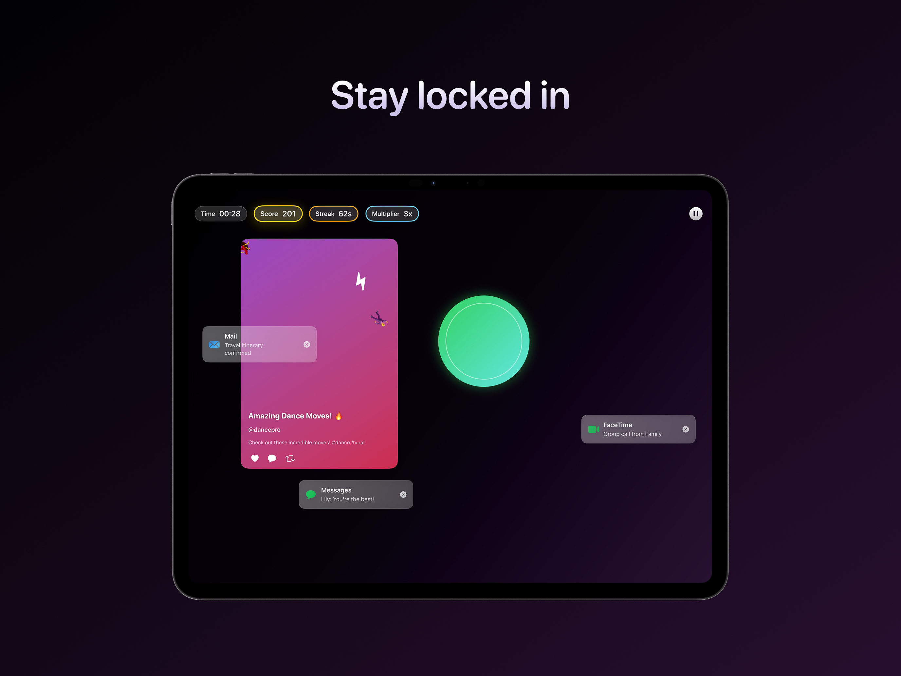
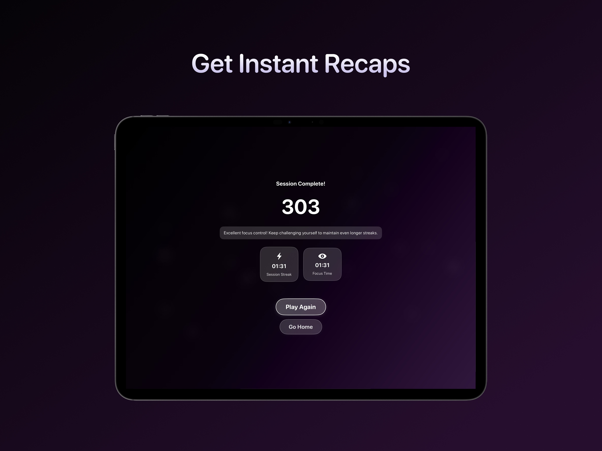
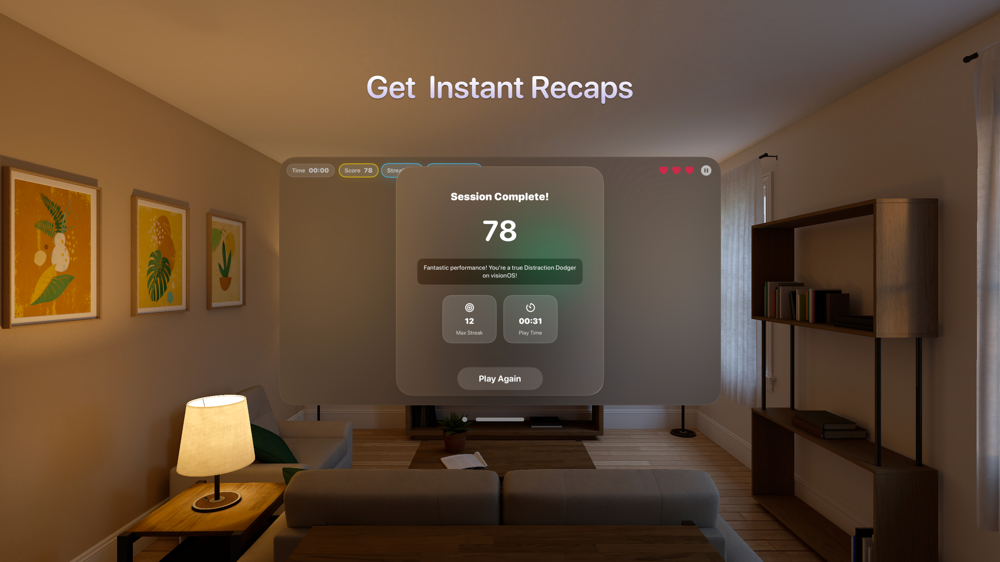
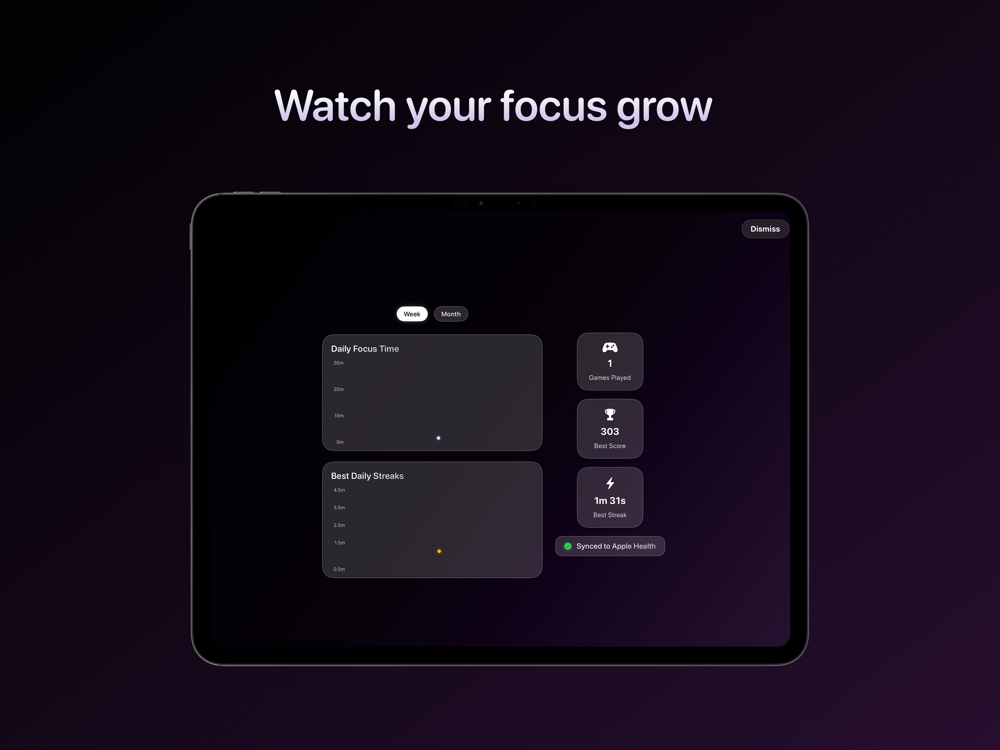

# Welcome to Distraction Dodge

A fun and effective focus training experience for iPad and Apple Vision.

## Features

- A comprehensive and interactive tutorial to get you upto the speed on the mechanics of the game.

<table align="center" width="100%" cellspacing="10" cellpadding="10">
  <tr>
    <td align="center" width="50%">
      
    </td>
    <td align="center" width="50%">
      
    </td>
  </tr>
</table>
  
- Select a custom training duration anywhere between 30 seconds and 5 minutes.

<table align="center" width="100%" cellspacing="10" cellpadding="10">
  <tr>
    <td align="center" width="50%">
      
    </td>
    <td align="center" width="50%">
      
    </td>
  </tr>
</table>
  
- Lock onto the glowing target using your gaze on iPad and indirect gestures on Apple Vision, and sharpen attention while real-world-style distractions fight for your gaze.

<table align="center" width="100%" cellspacing="10" cellpadding="10">
  <tr>
    <td align="center" width="50%">
      
    </td>
    <td align="center" width="50%">
      
    </td>
  </tr>
</table>

- Get an instant score recap, best streak, and a personalized tip to boost your next session.

<table align="center" width="100%" cellspacing="10" cellpadding="10">
  <tr>
    <td align="center" width="50%">
      
    </td>
    <td align="center" width="50%">
      
    </td>
  </tr>
</table>

- Track your daily best streaks, daily focus time, through interactive weekly and monthly charts, along with lifetime game count, best score and best streak.

<table align="center" width="100%" cellspacing="10" cellpadding="10">
  <tr>
    <td align="center" width="50%">
      
    </td>
    <td align="center" width="50%">
      
    </td>
  </tr>
</table>

- Seamlessly sync each session’s focus time to Apple Health as Mindful Minutes for a complete wellness overview.

<table align="center" width="100%" cellspacing="10" cellpadding="10">
  <tr>
    <td align="center" width="50%">
      
    </td>
    <td align="center" width="50%">
      
    </td>
  </tr>
</table>

## Architecture Highlights

- **SwiftUI** for declarative UI and animation on both platforms.

- **ARKit Face Tracking** (lookAtPoint, eyeBlink, eyeSquint) for gaze verification on iPad.

- **SwiftData** for persistence (Session, Streak models).

- **Swift Charts** for scatter-plot dashboards.

- **HealthKit** (HKCategoryTypeIdentifier.mindfulSession) opt-in export.

## Installation

1. Clone this repository: `git clone https://github.com/thisisayushs/DistractionDodge.git`
2. Open the project in Xcode.
3. Run the app on a simulator or connected device.

## Available on the App Store

https://apps.apple.com/us/app/distraction-dodge/id6745779732

## License

This project is licensed under the MIT License. See the [LICENSE](LICENSE) file for details.
